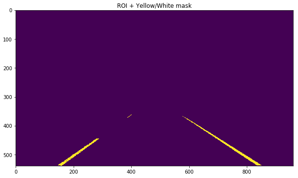
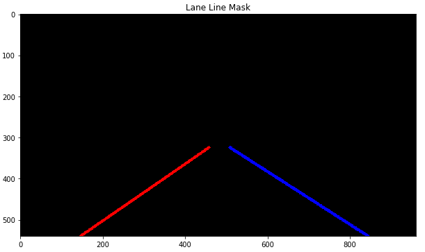
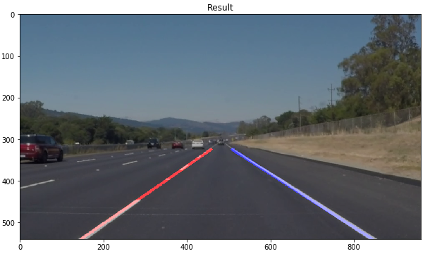
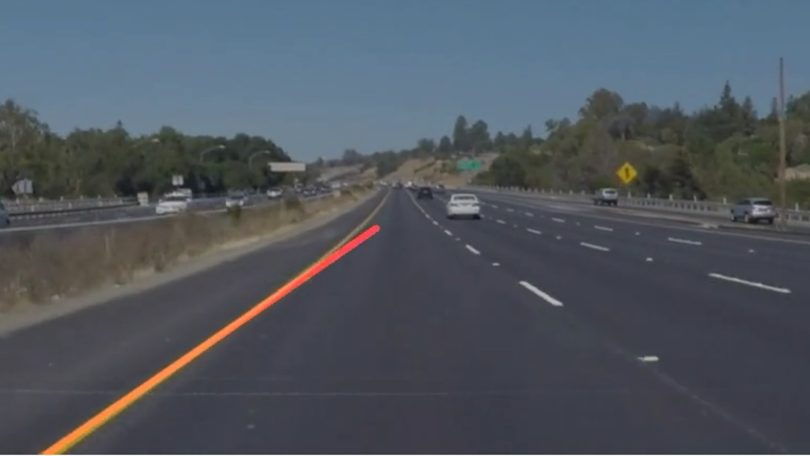
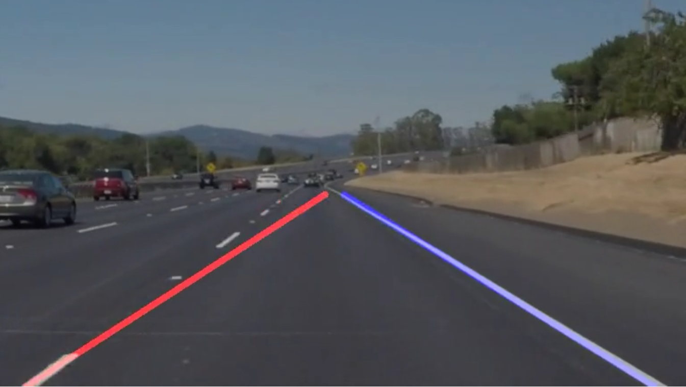
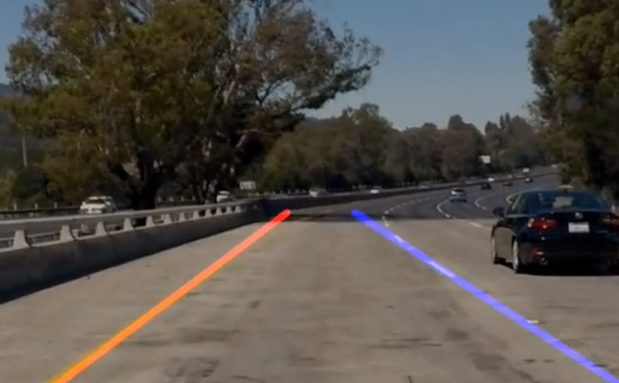

# **Finding Lane Lines on the Road**

## Overview
---

When we drive, we use our eyes to decide where to go.  The lines on the road that show us where the lanes are act as our constant reference for where to steer the vehicle.  Naturally, one of the first things we would like to do in developing a self-driving car is to automatically detect lane lines using an algorithm.

## Lane detection pipeline
---

- Basic lane detection pipeline -
  - Create a mask for just the lane colors - yellow and white (function - detect_yellow_and_white)
 
    - This step takes the RGB image and converts it to HSV.
    - It then identifies the yellow and white region based on specified HSV ranges.
    - Yellow and white masks are combined into a single one with equal weights.
    - These are being explicitly detected as there

  - Basic lane line detection on the above generated mask (function - basic_lane_line_detection)
    - Applies a ROI mask to the yellow-white lane mask.
    - Denoises it using Gaussian filter.
    - Runs Canny Edge detection.
    - Runs Hough transform for line detection.
  - Detect left and right lanes.
    - For each line detected by Hough transform
        - Ignores it if below the slope threshold - to ignore horizontal lines.
        - Identifies points corresponding to the left lane and those corresponding to the right lane
        - Fits a line to satisfy the left points for left lane and right points for right lane.
        - Gets x values for fixed min and max y values.
        - Thus, these points ((left_min_x, min_y), (left_max_x, max_y)) and ((right_min_x, min_y), (right_max_x, max_y)) give the final lines
  - Create a 3D mask with the lanes drawn - left in red and right in blue
 

  - Original image and lane line mask combined to give a the final output frame.
 

## Potential Shortcomings with current pipeline
---

- In case of some frames, lane edges are not detected if the white falls out of the hsv range.
 

- Lanes detected are too jittery between frames.
 

- Unable to identify lane curves as only lines are being detected right now.
 

## Possible improvements
---

- Detect 2D curves rather than 1D curves (lines)
- Keep track of the lanes detected in the past frames.
  - Lanes can't just change direction/color suddenly in real life.
  - Thus, missing information/lines in a frame should be deduced from historical data.
  - This would also help with overcoming sudden occlusion - other cars, pedestrians etc.
  - Some sort of weighted averaging or interpolation across frames.
- Smoothening of the overall lanes detected.